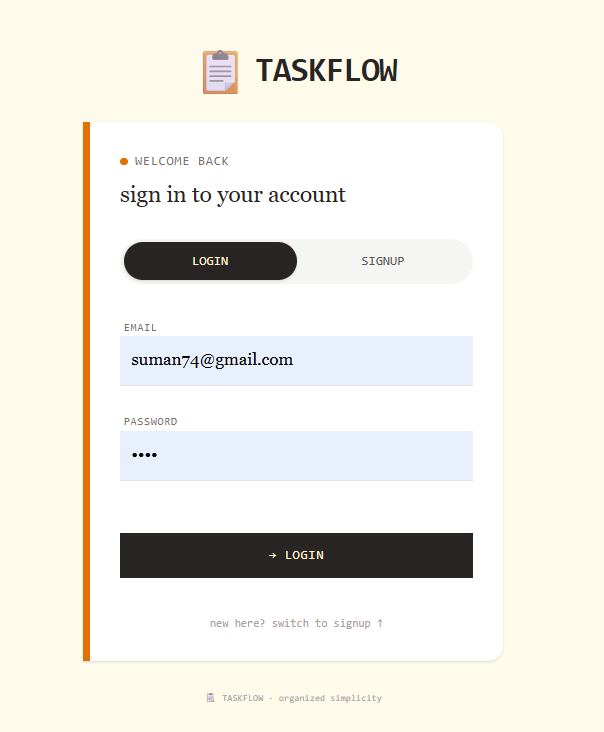
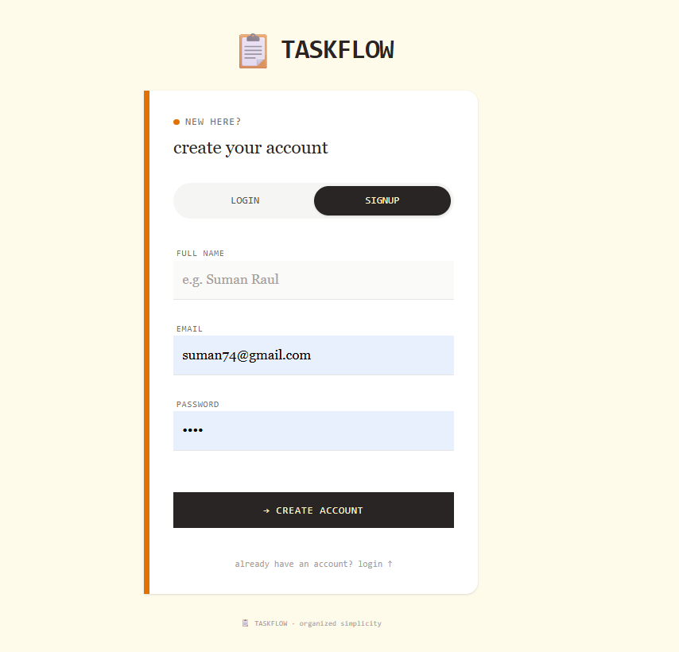
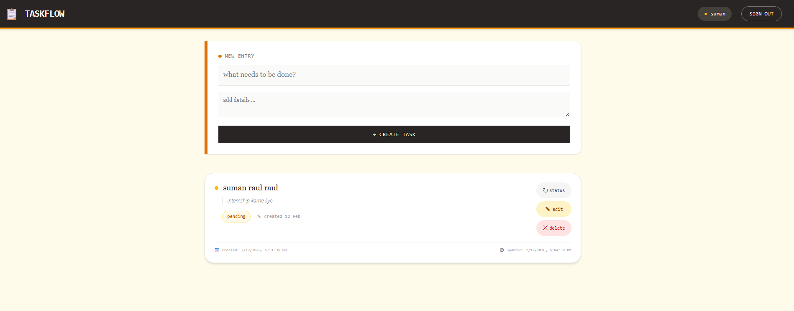

🚀 TASKFLOW – Secure Task Management System

TASKFLOW is a full-stack MERN application designed to manage tasks securely and efficiently.
It demonstrates authentication, protected routing, scalable backend architecture, and a modern responsive UI.

The system allows authenticated users to manage their tasks while maintaining strong security practices and clean project structure for scalability.

✅ Dashboard Features

👤 User Profile Display
User information is securely fetched from the backend and displayed on the dashboard.

📝 Full CRUD Operations
Users can:

Create tasks

View tasks

Update tasks

Delete tasks

🔍 Search & Filter Interface
Easily find tasks using search and filter options (e.g., status-based filtering).

🚪 Secure Logout Flow
User session is cleared and access to protected routes is revoked after logout.

✅ Security & Scalability

🔐 Password Hashing
User passwords are securely hashed using bcrypt before storing in the database.

🎟 JWT Authentication Middleware
API routes are protected using JSON Web Token verification.

⚠ Error Handling & Validation
Backend includes structured error responses and request validation to prevent invalid operations.

🧩 Scalable Code Architecture
Project follows modular structure:

Controllers

Models

Routes

Middleware
This ensures easy maintenance and future feature expansion.

🛠 Tech Stack
Frontend

React.js

Tailwind CSS

Axios

React Router

Backend

Node.js

Express.js

MongoDB

JWT Authentication

bcrypt

Mongoose

🔐 Authentication Flow

User registers or logs in

Password is hashed and verified securely

JWT token is issued

Token is validated on protected routes

Dashboard access granted only if authenticated

🎯 Project Goal

This project demonstrates:

Secure user authentication

Protected frontend routing

RESTful API design

Scalable backend architecture

Real-world CRUD implementation

Production-ready project structure

## Screenshots
 
 
 